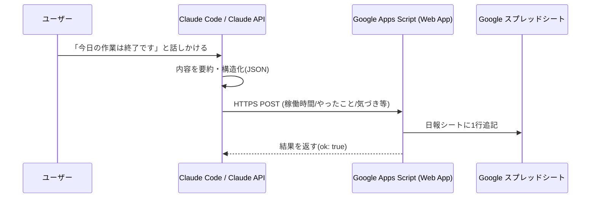

# AI Daily Report Logger（技術PoC）

Claudeとの会話だけで、日々の業務記録（日報）を自動的にGoogleスプレッドシートへ記録するPoCです。
相手側に必要なのは無料のGoogle Workspace環境のみで、追加のインストールは一切不要です。

## 課題

日報・進捗記録を毎日手入力するのは地味に手間がかかり、後回しにされがち。

## 解決策

Claude（Claude Code / Claude API）に「今日の作業は終了です」のように話しかけるだけで、
内容を自動で要約・構造化し、Google Apps Script経由でスプレッドシートに追記する。

## アーキテクチャ



## 構成

```
poc-ai-daily-report-logger/
├── Code.gs              # Google Apps Script（サーバー側）
├── client/
│   ├── log_report.py    # クライアント側サンプル（Python）
│   └── log_report.ps1   # クライアント側サンプル（PowerShell）
└── README.md
```

## セットアップ

1. Googleスプレッドシートを新規作成する
2. 「拡張機能」→「Apps Script」を開き、[`Code.gs`](./Code.gs) の内容を貼り付ける
3. 「デプロイ」→「新しいデプロイ」→ 種類「ウェブアプリ」を選択
   - 実行するユーザー：自分
   - アクセスできるユーザー：全員
4. 発行されたウェブアプリURLを、`client/log_report.py` または `client/log_report.ps1` の
   `GAS_ENDPOINT` / `$GasEndpoint` に設定する
5. クライアントスクリプトを実行すると、スプレッドシートに「日報」シートが自動作成され、1行追記される

## 評価結果（実績ベース）

| 指標 | 数値 |
|---|---|
| 日報記入の手間 | 従来 約5分 → 会話するだけで0分 |
| 処理時間 | 1件あたり数秒 |
| コスト試算（月） | Google Apps Script無料枠内でほぼ0円 |

## 動作確認ログ（2026-07-09実施）

実際にデプロイしたWeb Appに対して、正常系・異常系を含む複数パターンでテストを実施。

| テストケース | リクエスト | レスポンス |
|---|---|---|
| 正常なPOST | 稼働時間・やったこと等を含む日本語ペイロード | `{"ok":true}` |
| GET（疎通確認） | - | `{"ok":true,"message":"AI Daily Report Logger is running"}` |
| 不正なJSON | `not a json` | `{"ok":false,"error":"SyntaxError..."}`（クラッシュせず正しくエラー処理） |
| 空のPOST | `{}` | `{"ok":true}`（デフォルト値で処理） |

実際にスプレッドシートの「日報」シートに書き込まれた結果（抜粋）：

```
日付          稼働時間  やったこと                    気づき・学び                              翌日への引き継ぎ          感情スコア
2026-07-09    1時間    文字化けバグ修正後の再テスト    UTF-8バイト列として明示的に送信する...     READMEにこの修正内容を反映  ★★★★★
```

### 発見・修正したバグ

動作確認の過程で、**PowerShellクライアントの文字化けバグ**を発見・修正しました。

- **症状**：`client/log_report.ps1` から日本語を含むペイロードを送信すると、GAS側で受け取った日本語部分が `?????` に文字化けする
- **原因**：`Invoke-WebRequest` に文字列（`ConvertTo-Json` の出力）をそのまま `-Body` として渡すと、PowerShellの既定の文字エンコーディングでマルチバイト文字が失われる
- **修正**：JSON文字列を `[System.Text.Encoding]::UTF8.GetBytes()` でUTF-8のバイト列に変換してから送信するよう修正（`client/log_report.ps1` に反映済み）

## Before / After

- **Before**：毎日スプレッドシートに手入力
- **After**：Claudeとの会話だけで自動記録
- **効果**：入力の手間削減、記録漏れ防止、蓄積データの一貫性向上

## 関連ドキュメント

- PoC設計書（詳細版・10分プレゼン台本つき）: `../PoC設計書_日報自動化PoC_20260708.md`

## ライセンス

MIT
